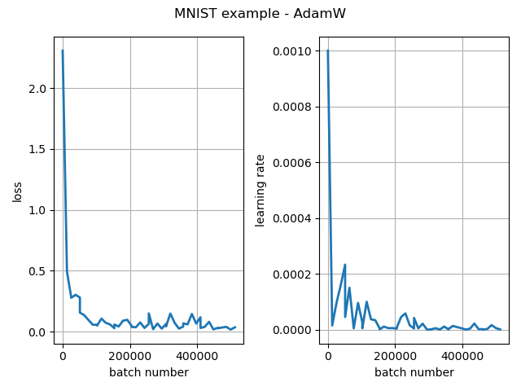

# `newt` :lizard:


[](https://codecov.io/gh/dscamiss/newt)

# Introduction

This package provides a PyTorch implementation of the Newton-like learning rate scheduler.

The general approach [1] is to attempt to minimize the loss function $L : \Theta \to \mathbb{R}$ by iterating

$$
\begin{align*}
    \theta_{t+1} = \theta_t - \alpha_t u_t \\
    \alpha_{t+1} = \alpha_t - \frac{g'_t(\alpha_t)}{g''_t(\alpha_t)},
\end{align*}
$$

where

* $\alpha_t$ is the learning rate at iteration $t$,
* $u_t$ is the $\theta$ update vector at iteration $t$, and
* $g_t(\alpha) = L(\theta_t - \alpha u_t)$.

In other words, we simultaneously run a gradient descent update on $\theta$ (using an arbitrary
optimizer to produce the update vectors) and a Newton update on $\alpha$.  

The implementation details primarily concern the Newton update, since directly computing $g''_t(\alpha_t)$ 
requires an expensive Hessian-vector product.  To work around this, we must use an approximation.
The approximations available in this package are described [here](https://dscamiss.github.io/blog/posts/newton-like-method/).
On top of the approximations, there are added heuristics to manage increasing loss values, to avoid a vanishing or diverging 
learning rate, etc.

# Installation

In an existing Python 3.9+ environment:

```python
git clone https://github.com/dscamiss/newt
pip install ./newt
```

# Usage

Import:

```python
from newt import Newt, NewtConfig
````

Create your model and loss criterion:

```python
model = MyModel(...)
loss_criterion = MyLossCriterion(...)
```

Create the corresponding `Newt` instance:

```python
newt_config = NewtConfig(model=model, loss_criterion=loss_criterion)
newt = Newt(optimizer, newt_config)
```

Add the LR scheduler step to the training loop:

```python
for batch_idx, (x, y) in enumerate(train_data_loader):
    x, y = x.to(device), y.to(device)
    optimizer.zero_grad()
    y_hat = model(x)
    loss = loss_criterion(y_hat, y)
    loss.backward()
    optimizer.step()

    newt.step_setup(loss, x, y)  # Computes lookahead gradients
    newt.step()                  # Consumes lookahead gradients
```

# Example

Traces for a simple MNIST example using the `AdamW` optimizer: 



# References

1. G. Retsinas, G. Sfikas, P. Filntisis and P. Maragos, "Newton-Based Trainable Learning Rate," ICASSP 2023.
2. G. Retsinas, G. Sfikas, P. Filntisis and P. Maragos, "Trainable Learning Rate",
2022, retracted.
